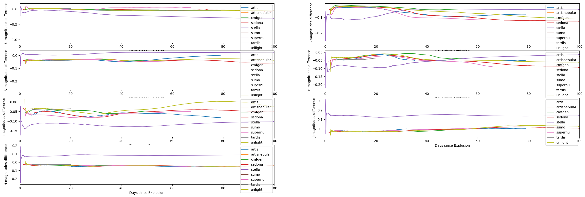
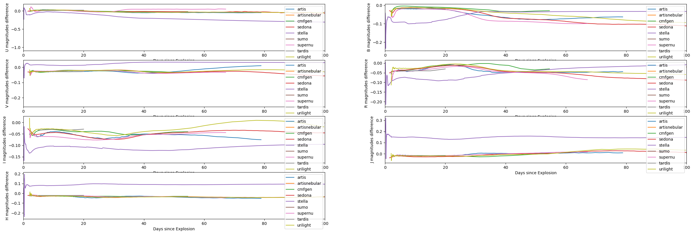
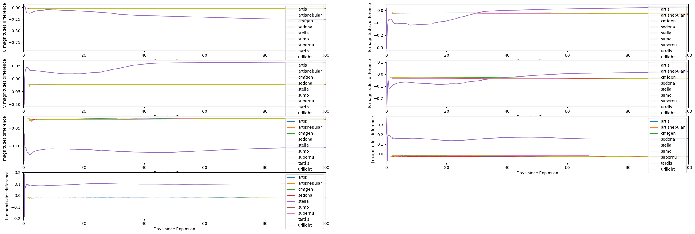
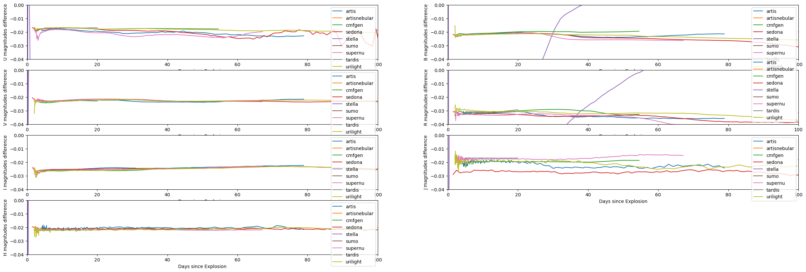
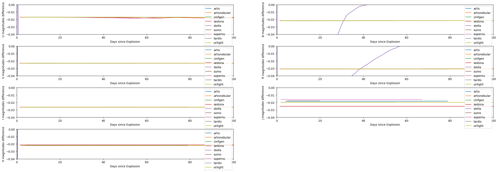
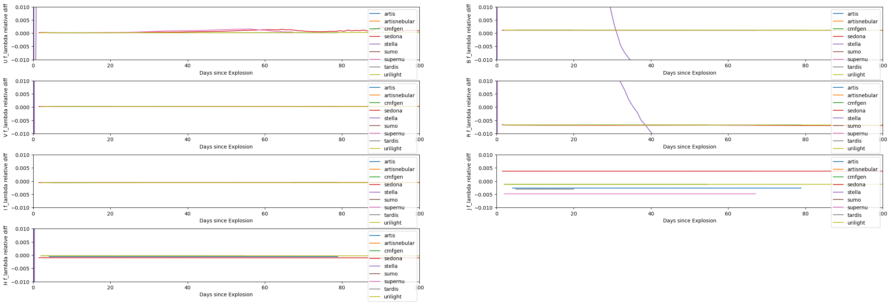
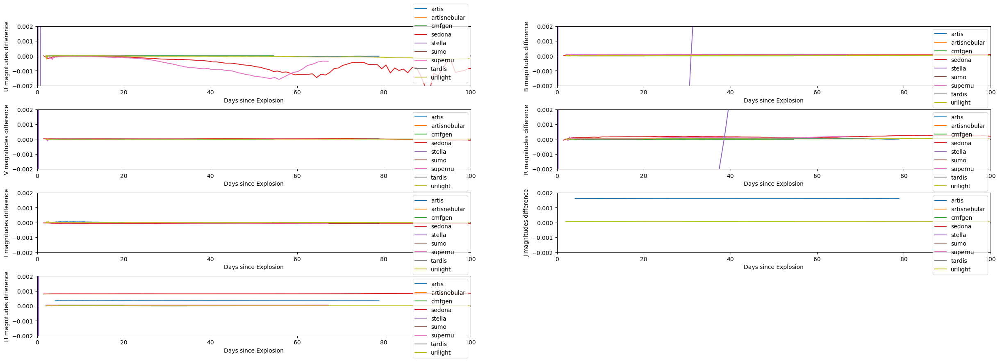

# Comparing magnitudes calculation of wsynphot with synphot_mlcs2k2 (Jha's package)

Following plots are $wsynphot\ magnitude - mlcs2k2\ magnitude$ light curves for each code in each band (UBVRIJH)

Note: difference for stella are irregularly high in all of the plots becuase it's coarsely sampled and for synthetic photometry it shouldn't be.

## wsynphot in default mode

Wsynphot parameters (compared with mlcs2k2):

- calibration spectrum: alpha_lyr_mod_002.fits (different)
- filter curves: UBVRI from Bessell, JHK from 2MASS (same)
- interpolation kind: linear (different)
- integration method: trapezoidal (same)



## Making changes in wsynphot

### wsynphot with mlcs2k2 calibration spectrum (alpha_lyr_stis_003.fits)



### wsynphot without lambda multiplication in calculation and above change

wsynphot was unaware that the filter response $(S(\lambda))$ in use was in ergs due to which the average flux through the filter was being calculated as $\frac{\int f_{\lambda}(\lambda)S(\lambda)\lambda d\lambda}{\int S(\lambda)\lambda d\lambda}$ instead of $\frac{\int f_{\lambda}(\lambda)S(\lambda) d\lambda}{\int S(\lambda) d\lambda}$. After correcting that:



Zoomed view (constraining y-axis to (-0.04, 0))


### wsynphot with mlcs2k2 interpolation (cubic spline) and above changes



## Zero Point (ZP) magnitudes comparison

wsynphot calculates ZP magnitudes during run-time by supplying calibration spectrum in the formula of average flux through the filter whereas mlcs2k2 reads ZP magnitudes from the passband files (they were apparently calculated from alpha_lyr_stis_003.fits and saved in each passband file - I may be wrong here).

### Comparing average filtered flux of mlcs2k2 with wsynphot (relative difference)



### Comparing ZP magnitude of mlcs2k2 with wsynphot

For [U, B, V, R, I, J, H]:

```
[-0.01673535, -0.02039771, -0.02270863, -0.03813954, -0.02686737,
-0.02104785, -0.02229228, -0.02414829]
```

This ~0.03 magnitudes difference in ZP (i.e. ~0.03 relative difference in the average filtered vega flux) is causing the difference in magnitudes because the differences in average filtered flux of mlcs2k2 with wsynphot are acceptably close. And it likely indicates the saved magnitudes in mlcs2k2 are not same as calculated by itself.

### Comparing saved ZP magnitudes of mlcs2k2 with that calculated by it

| filter | $calculated\ magnitude - saved\ magnitude$ |
| ------ | ------------------------------------------ |
| U      | -0.016894                                  |
| B      | -0.021668                                  |
| V      | -0.022988                                  |
| R      | -0.030811                                  |
| I      | -0.026242                                  |
| J      | -0.019807                                  |
| H      | -0.022018                                  |
| K      | -0.022929                                  |

### Comparing mlcs2k2 magnitudes (with calculated ZPs) with wsynphot magnitudes (with above changes)



This makes magnitudes finally very close but it's strange why in U band sedona and supernu differ too much which was not the case earlier.
